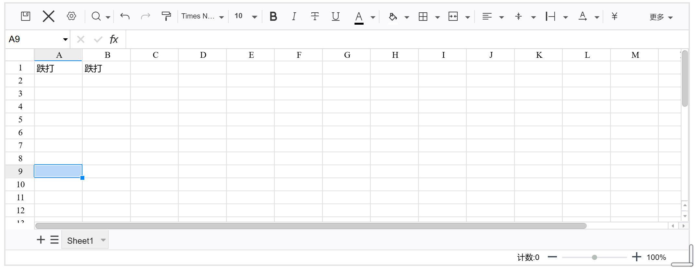
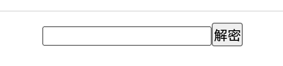

# widget-excel

## Function
The functionality is similar to that of widget-excel, based on luckysheet.
AES encryption is nested in the outer layer, and the data is saved in the widget properties.

## Note
By default, the data is automatically saved, but it is recommended to manually click the save button (to prevent data loss).
Each time the data is entered, it will cause the auto-save, and the auto-save will cause the Ciuyuan notes to update the index, which may be stuck at this time.
After creating a block, the default block size is not the most comfortable and needs to be adjusted manually.
The data is stored in the custom attribute data of the widget, do not modify the data, otherwise it will cause decryption failure

## Password security
Passwords are stored using AES encryption and can theoretically only be cracked by brute-force methods.
So as long as the password is complex enough, it can't be cracked.
However, if you set a common password (such as 123456 your birthday), it may be guessed by a dictionary.
When the table is edited and displayed, the password will be stored in memory. It can be viewed through the developer tools of Siyuan Notes.
So if the form is displayed and the computer is used by someone else, the password can be compromised.
Overall, security is sufficient for normal encryption.
If you forget your password, no one (including developers) can restore it (unless you guess it from memory).
The settings button can change the password.