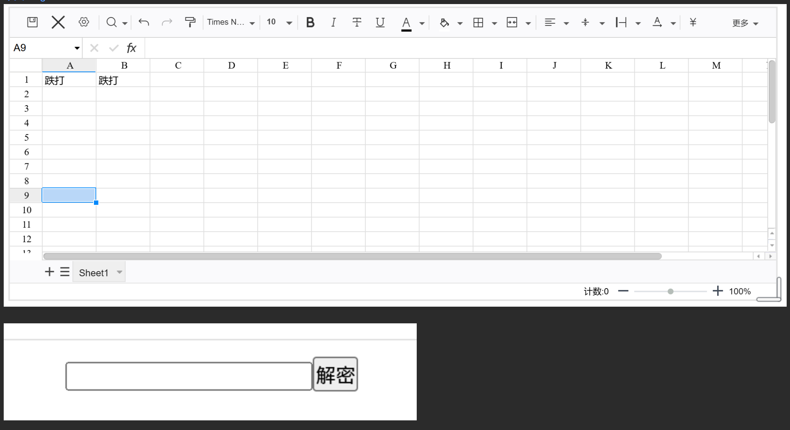

# widget-excel
[中文](README_zh_CN.md ) [English](README.md )

## 功能
功能同widget-excel差不多,基于luckysheet.
在外层嵌套了AES加密,数据保存在挂件属性中.

## 注意
数据默认有自动保存功能,但是还是建议手动点击保存按钮(以防止数据丢失)。
数据每次输入都会导致自动保存,自动保存会导致思源笔记更新索引,这时候可能会有卡顿。
创建块之后，默认块的大小并不是最舒服的，需要手动调整。
数据保存在 挂件自定义属性 data 中,请勿修改数据,否则会导致解密失败

## 密码安全
密码是使用AES加密存储的,理论上只能通过穷举法破解.
所以只要密码足够复杂就无法破解.
但是如果设置常见密码(比如 123456 你的生日)可能被字典猜测出来.
表格编辑,显示的时候,密码会存在内存中.通过思源笔记的开发者工具可以查看.
所以如果表格处于显示状态,电脑被其他人使用,密码是可能被泄露的.
整体来说 作为普通加密用安全性是足够的.
密码如果忘记 任何人(包括开发者)都无法还原(除非根据记忆猜测).
设置按钮可以修改密码.
